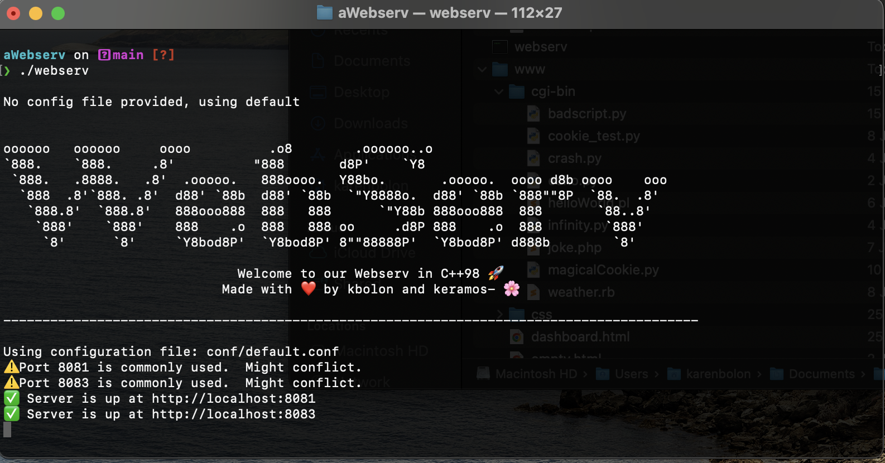
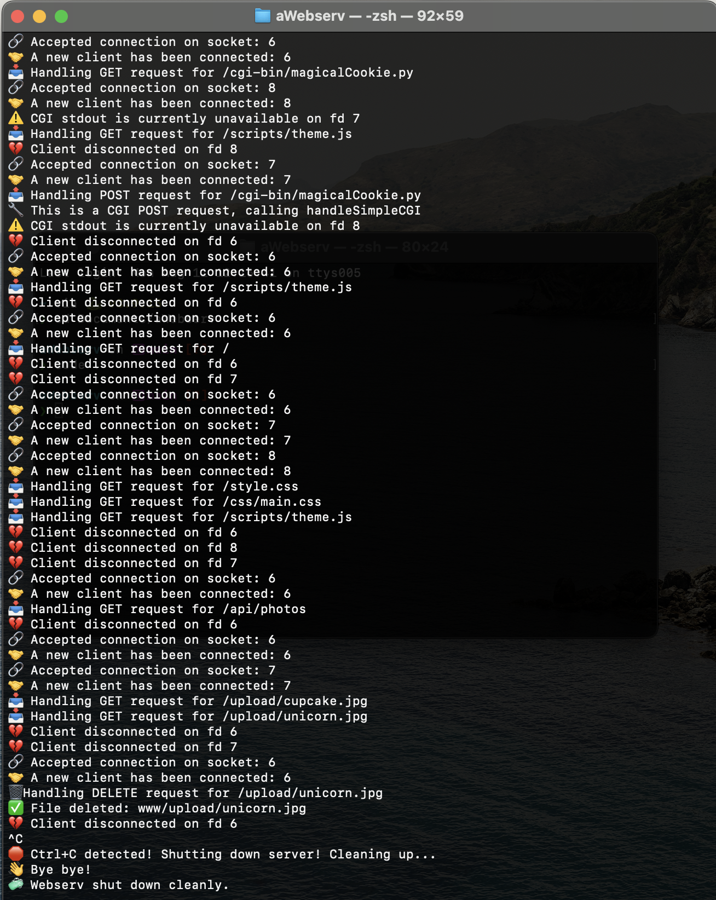

# 🌐 Webserv – Lightweight HTTP Server in C++98

Welcome to **Webserv**, a custom-built HTTP server implemented in C++98. This project follows NGINX-style configuration and supports multiple virtual servers, route-based logic, CGI execution, and file uploads — all with a clean non-blocking architecture using `poll()`.

---

## ✨ Features

- 🔧 **NGINX-inspired configuration** (custom `.conf` format)
- 🔁 **Multiple server blocks** with `listen`, `host`, `server_name`
- 📁 **Location blocks** with support for:
  - `root`, `index`
  - `autoindex on|off`
  - Allowed methods (`GET`, `POST`, `DELETE`)
  - `redirect` directives
  - `upload_path` for file uploads
  - `cgi` handlers for `.php`, `.py`, `.rb`, etc.
- 📦 **Static file serving**
- 🚫 **Custom error pages** (`404`, `500`, ...)
- 📤 **File upload support**
- ⚙️ **Non-blocking I/O** with a single `poll()` loop
- 🧪 Compatible with **browsers, curl, telnet, and testers**

---

[Click here to see walkthrough](https://youtu.be/ZJMYhFc1wIo "YouTube video")

